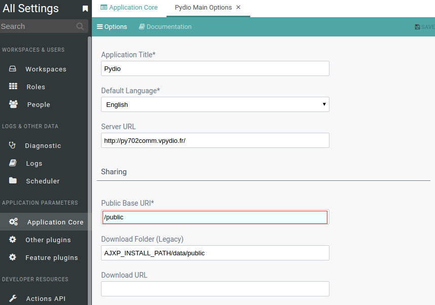

Pydio 7 was released with many changes. One of them is internal router to route http request to selective destination controller. This action base on request's URI for example /api, /share, /public. 
The complex configuration for .htaccess is mitigated and simplified.All request to Pydio application is routed to index.php point and you can forget it. Pydio will do the rest.
The default .htaccess for Pydio looks like:

~~~~
  <IfModule mod_rewrite.c>
  RewriteEngine on
  RewriteBase /
  RewriteCond %{REQUEST_FILENAME} !-f
  RewriteCond %{REQUEST_FILENAME} !-d
  RewriteRule (.*) index.php [L]

  AddType application/json .json

</IfModule>
~~~~

[nginx](https://github.com/pydio/pydio-core/blob/develop/core/src/nginx.conf.sample) [iis](https://github.com/pydio/pydio-core/blob/develop/core/src/web.config.sample)

In another hand, this change makes a new annoying problem on existed public links. They are no longer accessible. Because it requires a modification in the configuration of Apache

### Solution:
If you have old public link in this format:
http://www.domain.com/data/public/aabbcc

In configuration of apache (/etc/apache2/sites-enabled/pydio.conf), you have an alias to route all public link requests to /var/lib/pydio/data/public:

`Alias /data/public /var/lib/pydio/data/public`

That means all public links will be redirected to /var/lib/pydio/data. The request will be rewrited another times by rewrite rules in /var/lib/pydio/data/.htaccess and at the end, processed by /var/lib/pydio/data/public/shares.php.
 
But in Pydio 7, we do not need shares.php to handle the request, so we will redirect this kind of request to index.php.We add one redirect rule in /etc/apache2/sites-enabled/pydio.conf

~~~~
# rewrite for backward compability of public links
RedirectMatch "^/data/public/(.*)" "/public/$1"
~~~~

That means http://www.domain.com/data/public/aabbcc will be rewrited to http://www.domain.com/public/aabbcc by Apache before it reaches Pydio.

> Note: If your old public link has already been http://www.domain.com/public/aabbcc, you just delete /public (or /data/public) alias in apache conf.

> Restart your apache after modification.

Make sure that the config for public link is correct in Pydio settings GUI.

### How to remove /pydio in url
If you install pydio by using linux package management (apt, yum), pydio is accessible by /pydio alias.
For example: http://www.domain.com/pydio

The package management can't create a new virtual host in apache system for Pydio, so it relies on default VirtualHost of apache and create a alias /pydio to serve pydio service.

However, if your box provides only pydio service, /pydio become a redundant part in url and should be removed to make the url more clean.

Supposed we have http://www.domain.com/pydio and we want to change to http://www.domain.com

1. Address the path of pydio.conf. It usually locates in:

**Debian/Ubuntu**: /etc/apache2/sites-available or /etc/apache2/conf-available

**CentOS/RHEL**: /etc/httpd/conf.d/ or /opt/rh/httpd24/root/etc/httpd/conf.d

2. Change the name of this file pydio.conf to pydio.conf.old

3. Create a VirtualHost in new pydio.conf

~~~~
<VirtualHost www.domain.com:80> 
DocumentRoot "/usr/share/pydio"
	<Directory "/usr/share/pydio">
		Options FollowSymLinks
		AllowOverride Limit FileInfo
		Require all granted
	</Directory>
</VirtualHost>
~~~~

Then restart apache service, now you can access Pydio by using: http://www.domain.com

